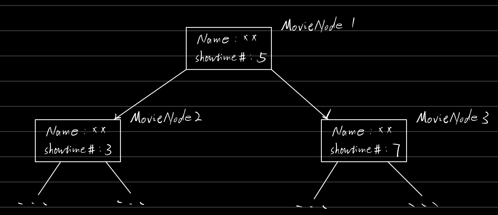

# SI507 Final Project 

### Name: Ruohong Li

### Email: ruohongl@umich.edu

### Demo Link: 

- https://drive.google.com/file/d/1dCRL92JaxevPEXSUw8SRjTK6lotFfAck/view?usp=sharing

----

## 1. How to supply API keys

- My program fetched data from 3 different movie APIs, all API keys are contained in `secret.py` file, which is uploaded on Canvas.

- `main_driver.py` is my driver program, run this file to start my program and then follow the instructions in the command line is fine

- Required Python packages:

  ```python
  import datatime
  import webbrowser
  import requests
  ```

## 2. Data Structure

- My choice: Binary search tree

  - I will use a binary search tree to sort movie showtime by the available playing time amount of a movie
  - Examples: 
    - For the option 1 in my program, I will request movie showtime by theater, all the movies will be constructed into a binary search tree with each tree node represent a movie and contains detail information of this movie. And all the movies will be sorted in this binary search tree by their showtime amount.

- Tree Structure Graph:

  

- `MovieTreeNode`

  ```python
  lass MovieTreeNode:
      '''a tree node for movie, contains detail info
  
      Instance Attributes
      -------------------
      name: string
          movie name
      link: string
          showtime google link for this movie
      showtime_list: list
          list of showing time, category by type
      showtime_num: int
          number of available showtime for this movie
      '''
  
      def __init__(self, name, link, showtime_list, left=None, right=None):
          self.name = name
          self.link = link
          self.showtime_list = showtime_list
          self.showtime_num = self._calculate_showtime_num()
          self.left = left
          self.right = right
  ```

- `MovieTree`

  ```python
  class MovieTree:
      '''a binary search tree contains movie information,
      sorted by # of showtime
  
      Instance Attributes
      -------------------
      root: MovieTreeNode
          root node of tree initially None
      size: int
      '''
  
      def __init__(self):
          self.root = None
          self.size = 0
  
      def insert(self, node):
          '''insert new node to tree, sort by showtime_num
          '''
          self.root = self._insert(node, self.root)
          self.size += 1
  
      def _insert(self, node, current_node):
          # base case
          if current_node == None:
              return node
  
          if node.showtime_num < current_node.showtime_num:
              current_node.left = self._insert(node, current_node.left)
          else:
              current_node.right = self._insert(node, current_node.right)
  
          return current_node
  ```

- **<font color=red>`tree.py` is where I construct my tree and `tree.json` is where I save a constructed tree.</font>**

- `tree.json`

  

---

---

